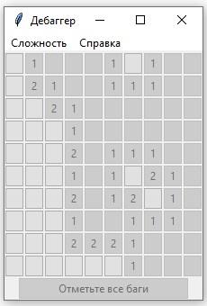

# Pet-проект игра Дебаггер (клон игры Сапер)

<p align="center">
 
</p>

Проект создан, чтобы повеселиться и немного разобраться как работает текстовая версия игры Сапер.

Затем была добавлена версия с графическим интерфейсом на Tkinter.

## Требования к библиотекам

Игра написана на python 3.11 с использованием стандартной предустановленной библиотеки Tkinter.
Дополнительно ничего устанавливать не нужно.

## Запуск игры

Для запуска текстовой версии игры Сапер выполните
```
python minesweeper.py
```

Для запуска игры Дебаггер с графическим интерфейсом выполните
```
python debugger_game_gui.py
```

## Автор

Валентин Т
